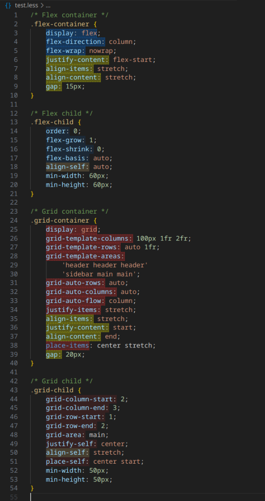

# FlexGrid Decorator

<!-- Visualize CSS Flexbox and Grid properties directly in VS Code. Highlights container and child properties with distinct colors, including shared properties between flex and grid. -->

Better visualization of CSS Flexbox and Grid properties, color-coded for easy identification of containers and children, including shared properties.

## Features

- Flex container (parent) → **blue with dotted border**  
- Flex child (item) → **light blue, no border**  
- Grid container (parent) → **red with dotted border**  
- Grid child (item) → **light red, no border**  
- Common container (flex + grid) → **yellow with dotted border**  
- Common child (flex + grid) → **light yellow, no border**  

**Rule of thumb:**  

<!-- - **Color** = layout type (blue = flex, red = grid, yellow = shared)   -->
- **Color** = If it is blue its flex, if it is red its grid, if it is yellow its shared
- **Dotted border** = is a container/parent property
- **No border** = is a child/item property

## Usage

- Open any CSS, SCSS, or LESS file.
- The extension automatically highlights flex/grid properties according to the above scheme.
- Shared properties (`align-items`, `justify-content`, etc.) are highlighted in yellow.

## Extension Settings

Currently, there are no configurable settings. Future versions may include:

- Custom colors for each category.
- Additional layout systems.

## Contributing

1. Fork the repository.
2. Make changes in `src/extension.ts`.
3. Test using the Extension Development Host.
4. Submit a pull request.

## License

MIT
